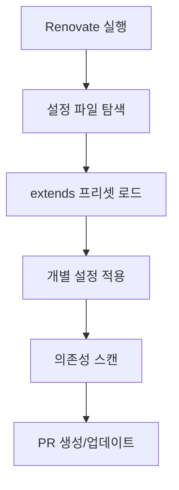

# Renovate - 크로스 플랫폼 의존성 자동 업데이트

Renovate는 프로젝트의 의존성을 자동으로 업데이트하는 도구입니다. GitHub, GitLab, Azure DevOps 등 다양한 플랫폼을 지원합니다.

## 왜 Renovate를 사용해야 할까요?

###  현실: 의존성 관리의 고민들

**의존성 관리, 정말 골치 아프죠:**

- 새 프로젝트 시작할 때마다 "이 라이브러리 버전 괜찮나?" 고민
- 보안 취약점 발견될 때마다 급하게 패키지 업데이트
- 팀원들이 각자 다른 버전 사용해서 "내 컴퓨터에서는 잘 되는데..." 상황
- 업데이트 미루다가 몇 개월 후엔 major 버전 차이로 업그레이드 지옥

**수동 관리의 한계:**

```bash
# 매번 이런 작업 반복...
npm outdated           # 업데이트 필요한 패키지 확인
npm update             # 업데이트 실행
npm test               # 테스트 돌려보고
# 문제 생기면 롤백하고...
git checkout package-lock.json
```

###  Renovate가 해결하는 문제들

**1. 보안 취약점 대응**

- CVE 발견되면 즉시 알림 + 자동 PR 생성
- 보안 패치는 자동 병합으로 빠른 대응
- "우리 서비스에 치명적인 보안 구멍이..." 같은 상황 방지

**2. 기술 부채 예방**

- 매주 작은 업데이트로 큰 변화 방지
- major 버전 업그레이드를 몇 개월씩 미루지 않아도 됨
- 새로운 기능과 성능 개선을 놓치지 않음

**3. 팀 생산성 향상**

- 개발자는 비즈니스 로직에 집중
- "패키지 업데이트 담당자" 따로 지정할 필요 없음
- PR 리뷰만 하면 되니까 부담 없음

**4. 일관성 보장**

- 모든 프로젝트가 동일한 업데이트 정책 적용
- 팀원 개인차로 인한 버전 불일치 방지

###  실제 경험담

**도입 전:**

```
개발자A: "어? lodash 보안 이슈 있다는데..."
개발자B: "아, 그거 언제 나온 건데? 우리 프로젝트들 다 확인해야겠네"
개발자C: "이번 스프린트는 바빠서... 다음에 하면 안 되나?"
PM: "보안 이슈인데 언제까지 처리 가능한가요?"
 2주 후...
개발자A: "아직 못 했는데 또 다른 패키지에서 이슈가..."
```

**도입 후:**

```
[자동]  Security Alert: lodash 4.17.20 → 4.17.21
 테스트 통과
 자동 병합 완료
개발자A: "어? 언제 lodash 업데이트됐지? 아, Renovate가 했구나!"
```

###  비즈니스 가치

**개발 속도 향상**

- 의존성 관리에 쓰던 시간을 기능 개발에 투자
- 새로운 라이브러리 기능을 빠르게 활용 가능

**위험 감소**

- 보안 취약점 노출 시간 최소화
- 대규모 업그레이드로 인한 서비스 장애 위험 감소

**유지보수 비용 절감**

- 기술 부채 누적 방지
- 장기적으로 시스템 안정성 향상

## 특징

- **크로스 플랫폼**: GitHub, GitLab, Azure DevOps, Bitbucket 지원
- **다양한 패키지 매니저**: npm, pnpm, yarn, pip, docker 등 지원
- **보안 업데이트**: 취약점이 발견된 의존성 자동 업데이트
- **유연한 설정**: 세밀한 업데이트 규칙 설정 가능
- **스마트 그룹화**: 관련 패키지들을 하나의 PR로 묶어서 관리
- **릴리스 노트**: 각 업데이트의 변경사항을 자동으로 수집

## 설치 방법 - 상황별 선택 가이드

###  SaaS vs Self-hosted 선택하기

**Renovate는 SaaS 서비스**이기 때문에 기본적으로 **외부 서비스와 연결**해야 합니다.

** 비교표:**

| 구분            | GitHub App (SaaS) | Self-hosted         |
| --------------- | ----------------- | ------------------- |
| **설치 난이도** |  매우 쉬움      |  복잡함       |
| **유지보수**    |  불필요         |  직접 관리    |
| **보안**        |  외부 의존    |  완전 통제    |
| **비용**        | 🆓 무료           | 💰 인프라 비용      |
| **권장 대상**   | 일반 프로젝트     | 금융/정부/보안 중시 |

###  1. GitHub App 설치 (권장)

**언제 사용하나요?**

- 일반적인 오픈소스나 상업 프로젝트
- 빠르고 간편하게 시작하고 싶을 때
- GitHub에서 호스팅하는 프로젝트

**설치 과정:**

```bash
# 1단계: 현재 저장소 상태 확인
cd your-project
git status  # 커밋되지 않은 변경사항 확인

# 2단계: 패키지 현황 파악 (선택사항)
npm audit        # 현재 취약점 확인
npm outdated     # 업데이트 가능한 패키지 확인
```

**웹에서 설치:**

1. [Renovate GitHub App](https://github.com/apps/renovate) 방문
2. **"Install"** 클릭
3. **저장소 선택**:
   - **"All repositories"**: 모든 저장소에 적용 (조직 계정 권장)
   - **"Selected repositories"**: 특정 저장소만 선택 (개인 계정 권장)
4. **권한 확인**:
   -  Pull Request 생성/수정
   -  Issues 생성 (Dependency Dashboard용)
   -  Repository contents 읽기
   -  Checks 상태 읽기 (CI 연동용)

**설치 완료 확인:**

```bash
# 저장소에 이런 이슈가 자동 생성됨
# "Configure Renovate" 또는 "Dependency Dashboard"
```

### 🏠 2. Self-hosted 설치

**언제 사용하나요?**

- 금융, 의료, 정부 등 보안이 극도로 중요한 프로젝트
- 내부 네트워크에서만 운영되는 시스템
- 모든 데이터와 프로세스를 완전히 통제하고 싶을 때
- GitLab, Azure DevOps 등 GitHub 외 플랫폼 사용시

**Docker로 설치 (권장):**

```bash
# 1. 환경 변수 설정
export RENOVATE_TOKEN="github_personal_access_token"
export RENOVATE_REPOSITORIES="owner/repo1,owner/repo2"

# 2. Docker 실행
docker run --rm \
  -e RENOVATE_TOKEN \
  -e RENOVATE_REPOSITORIES \
  -e LOG_LEVEL=debug \
  renovate/renovate

# 3. 크론잡으로 정기 실행 설정
# crontab -e
# 0 2 * * * docker run --rm -e RENOVATE_TOKEN -e RENOVATE_REPOSITORIES renovate/renovate
```

**npm으로 설치:**

```bash
# 1. 전역 설치
npm install -g renovate

# 2. 설정 파일 생성
cat > renovate-config.js << EOF
module.exports = {
  token: process.env.RENOVATE_TOKEN,
  repositories: ['owner/repo1', 'owner/repo2'],
  platform: 'github',
  onboarding: false,
  requireConfig: 'optional'
};
EOF

# 3. 실행
RENOVATE_TOKEN="your_token" renovate --config-file=renovate-config.js
```

**Self-hosted 장단점:**

** 장점:**

- 완전한 데이터 통제권
- 커스텀 규칙 무제한 추가
- 내부 네트워크 전용 패키지 저장소 지원
- 감사 로그 완전 관리

** 단점:**

- 서버 관리 부담 (업데이트, 모니터링, 백업)
- 토큰 관리의 복잡성
- 크론잡 설정 및 장애 대응
- Renovate 자체 업데이트 관리

### 🔐 보안 고려사항

**GitHub App 사용시:**

```bash
# 저장소 권한 최소화
# Settings > Integrations > Renovate > Configure
# - 필요한 저장소만 선택
# - 브랜치 보호 규칙 설정
# - 리뷰어 강제 지정
```

**Self-hosted 사용시:**

```bash
# 네트워크 격리
# - VPN 내에서만 실행
# - 방화벽으로 외부 접근 차단
# - 토큰 권한 최소화 (repo scope만)
```

###  첫 설치 후 주의사항

**어떤 방법을 선택하든:**

1. **첫 실행은 신중하게**: `dryRun: "full"` 설정으로 시뮬레이션만
2. **팀에게 미리 공지**: "Renovate 봇이 PR 만들 예정입니다"
3. **브랜치 보호 규칙 설정**: main/master 브랜치 직접 푸시 방지
4. **알림 설정**: Dependency Dashboard 이슈 구독

**예상되는 첫 반응:**

```
😱 "어? 갑자기 PR이 20개나 생겼어요!"
→ 정상입니다. 그동안 밀린 업데이트들이에요.

🤔 "이거 다 믿고 머지해도 되나요?"
→ patch 업데이트부터 천천히 시작하세요.

😅 "설정을 어떻게 바꾸죠?"
→ renovate.json 파일 수정하면 바로 적용됩니다.
```

## 기본 설정 - 한 줄씩 이해하기

###  최소 동작 설정 (renovate.json)

**파일 위치**: 프로젝트 루트에 `renovate.json` 생성

```json
{
  "$schema": "https://docs.renovatebot.com/renovate-schema.json",
  "extends": ["config:base"]
}
```

** 각 설정 설명:**

```json
{
  // 1. IDE 자동완성과 유효성 검사를 위한 스키마 정의
  // 없어도 동작하지만, 설정 실수를 방지해줌
  "$schema": "https://docs.renovatebot.com/renovate-schema.json",

  // 2. 사전 정의된 설정 묶음을 가져옴
  // config:base = Renovate의 기본 권장 설정들
  "extends": ["config:base"]
}
```

### 🤔 "정말 이게 전부인가요?"

**네, 맞습니다!** 이 두 줄이면 Renovate가 동작합니다.

**config:base가 포함하는 내용:**

- 매주 의존성 확인
- patch와 minor 업데이트 자동 PR 생성
- major 업데이트는 수동 검토용 PR 생성
- 보안 취약점 발견시 즉시 알림
- 중복 패키지 정리 (dedupe)
- 기본 커밋 메시지 형식

**즉, 기본 설정만으로도:**

```bash
# 이런 PR들이 자동 생성됩니다
"Update dependency lodash to v4.17.21 [SECURITY]"
"Update dependency react to v18.2.0"
"Update dependency @types/node to v18.15.11"
```

###  설정 파일 위치별 우선순위

Renovate는 여러 위치에서 설정을 찾습니다:

```bash
your-project/
├── renovate.json          # 1순위 (권장)
├── renovate.json5         # 2순위 (주석 지원)
├── .renovaterc            # 3순위 (구형)
├── .renovaterc.json       # 4순위
├── package.json           # 5순위 (renovate 필드)
└── .github/
    └── renovate.json      # 6순위 (조직 설정)
```

**권장: `renovate.json` 사용**

- 명확한 파일명
- JSON 표준 문법
- IDE 지원 우수

###  설정이 적용되는 과정



**실제 동작 순서:**

1. **설정 로드**: renovate.json 읽기
2. **프리셋 확장**: config:base의 모든 규칙 가져오기
3. **패키지 스캔**: package.json, package-lock.json 분석
4. **업데이트 확인**: npm 레지스트리에서 새 버전 확인
5. **PR 생성**: 업데이트가 필요한 경우 자동 PR 생성

###  프로젝트별 첫 설정 추천

**React 프로젝트:**

```json
{
  "$schema": "https://docs.renovatebot.com/renovate-schema.json",
  "extends": ["config:base"],
  "timezone": "Asia/Seoul"
}
```

**Vue 프로젝트:**

```json
{
  "$schema": "https://docs.renovatebot.com/renovate-schema.json",
  "extends": ["config:base", "config:js-lib"],
  "timezone": "Asia/Seoul"
}
```

**Node.js 백엔드:**

```json
{
  "$schema": "https://docs.renovatebot.com/renovate-schema.json",
  "extends": ["config:base"],
  "timezone": "Asia/Seoul",
  "vulnerabilityAlerts": {
    "enabled": true
  }
}
```

**모노레포 (pnpm):**

```json
{
  "$schema": "https://docs.renovatebot.com/renovate-schema.json",
  "extends": ["config:base"],
  "timezone": "Asia/Seoul",
  "postUpdateOptions": ["pnpmDedupe"]
}
```

## 고급 설정

### 포괄적인 설정 예시

```json
{
  "$schema": "https://docs.renovatebot.com/renovate-schema.json",
  "extends": [
    "config:base",
    ":dependencyDashboard",
    ":semanticCommits",
    ":preserveSemverRanges"
  ],
  "timezone": "Asia/Seoul",
  "prHourlyLimit": 10,
  "prConcurrentLimit": 5,
  "rangeStrategy": "bump",
  "postUpdateOptions": ["pnpmDedupe"],

  "packageRules": [
    {
      "matchPaths": ["apps/**"],
      "groupName": "apps dependencies",
      "labels": ["apps"]
    },
    {
      "matchPaths": ["packages/**"],
      "groupName": "packages dependencies",
      "labels": ["packages"]
    },
    {
      "matchPackagePatterns": ["^@types/react", "^react"],
      "groupName": "react ecosystem"
    },
    {
      "matchPackageNames": ["vite", "@vitejs/plugin-react", "vitest"],
      "groupName": "vite ecosystem"
    },
    {
      "matchUpdateTypes": ["major"],
      "labels": ["major-update"],
      "automerge": false
    },
    {
      "matchUpdateTypes": ["patch"],
      "automerge": true,
      "automergeType": "branch",
      "platformAutomerge": true
    },
    {
      "matchDatasources": ["npm"],
      "matchDepTypes": ["dependencies"],
      "vulnerabilityAlerts": {
        "enabled": true,
        "labels": ["security"],
        "automerge": true
      }
    }
  ],

  "commitMessagePrefix": "chore(deps):",
  "commitMessageAction": "update",
  "commitMessageTopic": "{{depName}}",
  "commitMessageExtra": "to {{newVersion}}",

  "prCreation": "immediate",
  "prTitle": "chore(deps): update {{groupName}}",
  "prBodyTemplate": "{{{table}}}{{{notes}}}{{{changelogs}}}",

  "dependencyDashboard": true,
  "dependencyDashboardTitle": " Dependency Updates Dashboard",

  "platformAutomerge": true,
  "automergeSchedule": ["after 10pm every weekday"],

  "ignoreDeps": ["package-to-ignore"],

  "node": {
    "supportPolicy": ["lts_active"]
  }
}
```

## 주요 설정 옵션

### extends 프리셋 - 미리 만들어진 설정 조합

**프리셋이란?** 자주 사용되는 설정들을 미리 묶어놓은 템플릿입니다.

```json
{
  "extends": [
    "config:base", // 📦 기본 필수 설정
    ":dependencyDashboard", //  의존성 현황판
    ":semanticCommits", //  체계적인 커밋 메시지
    ":preserveSemverRanges", //  버전 범위 보존
    "group:allNonMajor", // 📎 업데이트 그룹화
    ":automergeMinor", // 🤖 minor 자동 병합
    ":automergePatch", // 🤖 patch 자동 병합
    ":rebaseStalePrs" //  오래된 PR 자동 갱신
  ]
}
```

### 📦 주요 프리셋 상세 가이드

####  config:base (필수)

```json
// 이 설정이 포함하는 내용:
{
  "schedule": ["at any time"],
  "prCreation": "immediate",
  "rangeStrategy": "replace",
  "semanticCommits": "auto",
  "configMigration": true,
  "packageRules": [
    {
      "matchUpdateTypes": ["major"],
      "automerge": false // major 업데이트는 수동 검토
    },
    {
      "matchUpdateTypes": ["minor", "patch"],
      "automerge": true // minor/patch는 자동 병합 후보
    }
  ]
}
```

**언제 사용:** 모든 프로젝트에 필수

####  :dependencyDashboard

```json
// 활성화되는 기능:
{
  "dependencyDashboard": true,
  "dependencyDashboardTitle": " Dependency Dashboard",
  "dependencyDashboardHeader": "이 이슈에서 모든 의존성 업데이트를 관리합니다",
  "dependencyDashboardFooter": "renovate.json에서 설정을 수정할 수 있습니다"
}
```

**결과:** 저장소에 "Dependency Dashboard" 이슈가 자동 생성되어 모든 의존성 현황을 한눈에 파악
**언제 사용:** 팀 프로젝트에 강력 추천

####  :semanticCommits

```json
// 커밋 메시지 형식:
{
  "semanticCommits": "enabled",
  "semanticCommitType": "chore",
  "semanticCommitScope": "deps"
}
```

**결과:** `chore(deps): update dependency react to v18.2.0` 형태의 체계적 커밋
**언때 사용:** Conventional Commits를 사용하는 프로젝트

####  :preserveSemverRanges

```json
// Before: "react": "^17.0.0"
// After:  "react": "^18.2.0"  (범위 문법 유지)

// 설정 없이는:
// Before: "react": "^17.0.0"
// After:  "react": "18.2.0"   (정확한 버전으로 변경)
```

**언제 사용:** 유연한 버전 관리를 원하는 라이브러리 프로젝트

#### 📎 group:allNonMajor

```json
// 여러 개의 개별 PR 대신:
//  "Update dependency react to v18.1.0"
//  "Update dependency react-dom to v18.1.0"
//  "Update dependency @types/react to v18.0.1"

// 하나의 그룹 PR로:
//  "Update all non-major dependencies"
```

**언제 사용:** PR 개수를 줄이고 싶을 때

#### 🤖 :automergeMinor / :automergePatch

```json
{
  "packageRules": [
    {
      "matchUpdateTypes": ["minor"],
      "automerge": true,
      "automergeType": "pr" // PR 생성 후 자동 병합
    },
    {
      "matchUpdateTypes": ["patch"],
      "automerge": true,
      "automergeType": "branch" // PR 없이 직접 병합
    }
  ]
}
```

**주의:** CI 테스트 통과가 전제 조건
**언제 사용:** 안정적인 CI/CD가 구축된 프로젝트

####  :rebaseStalePrs

```json
{
  "rebaseWhen": "behind-base-branch", // 메인 브랜치보다 뒤처질 때
  "platformAutomerge": true // 플랫폼 자동 병합 활용
}
```

**결과:** 오래된 PR을 자동으로 최신 상태로 갱신
**언제 사용:** 활발한 개발이 이루어지는 프로젝트

###  상황별 프리셋 조합 추천

** 빠른 개발팀 (스타트업)**

```json
{
  "extends": [
    "config:base",
    ":dependencyDashboard",
    ":automergeMinor",
    ":automergePatch",
    "group:allNonMajor"
  ]
}
```

**🏢 신중한 개발팀 (대기업)**

```json
{
  "extends": [
    "config:base",
    ":dependencyDashboard",
    ":semanticCommits",
    ":preserveSemverRanges"
  ]
}
```

**📚 오픈소스 라이브러리**

```json
{
  "extends": [
    "config:base",
    ":semanticCommits",
    ":preserveSemverRanges",
    "helpers:pinGitHubActionDigests" // GitHub Actions 보안 강화
  ]
}
```

** 보안 중시 프로젝트**

```json
{
  "extends": [
    "config:base",
    ":dependencyDashboard",
    "docker:enableMajor", // Docker 이미지도 관리
    "security:openssf-scorecard" // 오픈소스 보안 점수 확인
  ]
}
```

### packageRules (규칙 설정)

```json
{
  "packageRules": [
    // 패키지 이름으로 매칭
    {
      "matchPackageNames": ["lodash"],
      "enabled": false // lodash 업데이트 비활성화
    },

    // 패턴으로 매칭
    {
      "matchPackagePatterns": ["^@types/"],
      "groupName": "type definitions",
      "automerge": true
    },

    // 파일 경로로 매칭
    {
      "matchPaths": ["apps/frontend/**"],
      "labels": ["frontend"],
      "reviewers": ["team-frontend"]
    },

    // 업데이트 타입별 처리
    {
      "matchUpdateTypes": ["major"],
      "automerge": false,
      "assignees": ["@tech-lead"]
    },

    // 의존성 타입별 처리
    {
      "matchDepTypes": ["devDependencies"],
      "automerge": true
    }
  ]
}
```

### 스케줄링 - 언제 업데이트를 실행할지 결정

**Renovate의 스케줄링은 cron과 다른 자연어 문법을 사용합니다.**

#### 📅 기본 스케줄 문법

```json
{
  //  기본 스케줄 설정
  "schedule": [
    "after 10pm every weekday", // 평일 오후 10시 이후
    "before 5am every weekday", // 평일 오전 5시 이전
    "every weekend" // 주말 언제든지
  ],

  // 🌏 시간대 설정 (중요!)
  "timezone": "Asia/Seoul",

  // 🤖 자동 병합 전용 스케줄 (별도 설정 가능)
  "automergeSchedule": ["after 10pm every weekday"]
}
```

#### 🕐 시간 표현 방법

**시간대별 표현:**

```json
{
  "schedule": [
    "after 9pm", // 오후 9시 이후
    "before 6am", // 오전 6시 이전
    "after 10pm on friday", // 금요일 오후 10시 이후
    "between 11pm and 5am", // 오후 11시~오전 5시 사이
    "after 10pm on weekdays", // 평일 오후 10시 이후
    "on the first day of the month" // 매월 1일
  ]
}
```

**요일별 표현:**

```json
{
  "schedule": [
    "every weekday", // 월~금
    "every weekend", // 토~일
    "on monday", // 매주 월요일
    "on friday", // 매주 금요일
    "on saturday and sunday", // 토요일과 일요일
    "on the first monday of the month" // 매월 첫째 주 월요일
  ]
}
```

####  실무 스케줄 패턴

**🌙 야간 업무 방해 방지**

```json
{
  "schedule": ["after 10pm every weekday", "before 5am every weekday"],
  "timezone": "Asia/Seoul"
}
```

_이유: 개발자들이 작업하지 않는 시간에 PR 생성_

**📆 주간 배치 처리**

```json
{
  "schedule": ["before 9am on monday"],
  "timezone": "Asia/Seoul"
}
```

_이유: 주간 계획 세우기 전에 미리 의존성 현황 파악_

** 즉시 처리 (스타트업)**

```json
{
  "schedule": ["at any time"] // 기본값
}
```

_이유: 빠른 개발 사이클, 즉시 업데이트 적용_

**🏢 월간 배치 (대기업)**

```json
{
  "schedule": ["on the first monday of the month"],
  "timezone": "Asia/Seoul"
}
```

_이유: 신중한 변경 관리, 충분한 검토 시간_

####  긴급 vs 일반 업데이트 분리

```json
{
  "schedule": ["before 9am on monday"],
  "timezone": "Asia/Seoul",

  "packageRules": [
    {
      //  보안 취약점은 즉시 처리
      "matchDatasources": ["npm"],
      "vulnerabilityAlerts": {
        "enabled": true,
        "schedule": ["at any time"] // 스케줄 무시하고 즉시
      }
    },
    {
      //  major 업데이트는 월간 처리
      "matchUpdateTypes": ["major"],
      "schedule": ["on the first monday of the month"]
    },
    {
      //  patch 업데이트는 주간 처리
      "matchUpdateTypes": ["patch"],
      "schedule": ["before 9am on monday"]
    }
  ]
}
```

#### 🤖 자동 병합 스케줄

```json
{
  // PR 생성 스케줄
  "schedule": ["before 9am on monday"],

  // 자동 병합 스케줄 (별도 설정)
  "automergeSchedule": ["after 10pm every weekday"],

  "packageRules": [
    {
      "matchUpdateTypes": ["patch"],
      "automerge": true,
      "automergeType": "pr" // PR 생성 후 스케줄에 맞춰 자동 병합
    }
  ]
}
```

**동작 과정:**

1. **월요일 오전 9시 이전**: PR 생성
2. **평일 오후 10시 이후**: 조건에 맞는 PR 자동 병합

#### 🌍 시간대 주의사항

```json
{
  //  잘못된 예: 시간대 미설정
  "schedule": ["after 10pm every weekday"]
  // → UTC 기준으로 동작 (한국시간 오전 7시!)

  //  올바른 예: 시간대 명시
  "schedule": ["after 10pm every weekday"],
  "timezone": "Asia/Seoul"
  // → 한국시간 기준으로 동작
}
```

**주요 시간대:**

- `Asia/Seoul` (한국)
- `America/New_York` (미국 동부)
- `America/Los_Angeles` (미국 서부)
- `Europe/London` (영국)
- `UTC` (협정 세계시)

####  스케줄 효과 비교

| 스케줄 전략   | 장점           | 단점           | 추천 대상 |
| ------------- | -------------- | -------------- | --------- |
| **즉시 처리** | 빠른 대응      | 업무 방해      | 스타트업  |
| **야간 처리** | 업무 방해 없음 | 지연 발생      | 일반 팀   |
| **주간 배치** | 계획적 관리    | 취약점 노출    | 신중한 팀 |
| **월간 배치** | 안정성 우선    | 기술 부채 누적 | 대기업    |

####  스케줄 디버깅

**설정이 동작하는지 확인:**

```bash
# Dependency Dashboard에서 다음 항목 확인:
# - "Next scheduled update: ..."
# - "Last run: ..."
# - "Scheduled updates are paused" (설정 문제시)
```

**일반적인 문제:**

-  `timezone` 미설정 → UTC로 동작
-  너무 제한적인 스케줄 → 업데이트 안 됨
-  `schedule: []` → 완전 비활성화

### 커밋 메시지 커스터마이징 - 템플릿 문법 완전 가이드

**Renovate는 Handlebars 템플릿 엔진을 사용합니다.**

#### 🔤 괄호 문법의 차이점

```json
{
  //  기본 템플릿 구성 요소들
  "commitMessagePrefix": "chore(deps):", // 고정 접두사
  "commitMessageAction": "update", // 동작 설명 (update/add/remove)
  "commitMessageTopic": "{{depName}}", // {{변수}} = HTML 이스케이프됨
  "commitMessageExtra": "to {{newVersion}}", // 추가 정보
  "commitMessageSuffix": "[skip ci]", // 고정 접미사

  //  커밋 본문 (선택사항)
  "commitBody": "See release notes: {{{releases}}}", // {{{변수}}} = 원본 HTML 그대로

  //  시맨틱 커밋 설정
  "semanticCommits": "enabled", // "enabled"|"disabled"|"auto"
  "semanticCommitType": "chore", // commit type
  "semanticCommitScope": "deps" // commit scope
}
```

####  템플릿 변수 괄호 문법

**{{ }} vs {{{ }}} 차이점:**

```json
{
  // {{variable}} = HTML 이스케이프 (안전)
  "commitMessageTopic": "{{depName}}",
  // 결과: "react" → "react"
  // 결과: "<script>" → "&lt;script&gt;"

  // {{{variable}}} = 원본 그대로 (위험하지만 필요한 경우)
  "commitBody": "Release notes: {{{releases}}}"
  // 결과: HTML 태그와 마크다운이 그대로 출력
  // 주의: XSS 공격 가능성 있음 (패키지명에는 사용 안함)
}
```

**실제 사용 예시:**

```bash
# {{depName}} 사용시
chore(deps): update react to v18.2.0

# {{{depName}}} 사용시 (동일한 결과, 하지만 보안상 비추천)
chore(deps): update react to v18.2.0

# {{{releases}}} 사용시 (릴리즈 노트에 마크다운 포함)
See release notes:
## What's Changed
* Fix memory leak by @author in #123
```

####  주요 템플릿 변수들

```json
{
  // 📦 패키지 정보
  "commitMessageTopic": "{{depName}}", // 패키지명: "react"
  "commitMessageExtra": "to {{newVersion}}", // 새 버전: "18.2.0"

  //  기타 유용한 변수들
  "prTitle": "{{depName}} {{currentVersion}} → {{newVersion}}",
  // currentVersion: 현재 버전 "18.1.0"
  // newVersion: 새 버전 "18.2.0"
  // newVersionMajor: 주 버전 "18"
  // newVersionMinor: 부 버전 "2"
  // newVersionPatch: 패치 버전 "0"

  //  업데이트 타입
  "commitMessage": "{{depName}} {{updateType}} update",
  // updateType: "major"|"minor"|"patch"|"pin"|"rollback"

  //  경로 정보
  "commitMessage": "{{parentDir}}: update {{depName}}",
  // parentDir: "packages/ui", "apps/web" 등

  // 🏷️ 그룹 정보
  "prTitle": "{{groupName}} updates"
  // groupName: "react ecosystem", "testing tools" 등
}
```

####  실무 커밋 메시지 패턴

** Basic Pattern (기본)**

```json
{
  "commitMessagePrefix": "chore(deps):",
  "commitMessageAction": "update",
  "commitMessageTopic": "{{depName}}",
  "commitMessageExtra": "to {{newVersion}}"
}
```

**결과:** `chore(deps): update react to 18.2.0`

**🔖 Semantic Commits (시맨틱)**

```json
{
  "semanticCommits": "enabled",
  "semanticCommitType": "chore",
  "semanticCommitScope": "deps",
  "commitMessageAction": "update",
  "commitMessageTopic": "{{depName}}",
  "commitMessageExtra": "to v{{newVersion}}"
}
```

**결과:** `chore(deps): update react to v18.2.0`

**🏢 Enterprise Pattern (기업용)**

```json
{
  "commitMessagePrefix": "[AUTO]",
  "commitMessageAction": "bump",
  "commitMessageTopic": "{{depName}}",
  "commitMessageExtra": "{{currentVersion}} → {{newVersion}}",
  "commitMessageSuffix": "[skip ci]"
}
```

**결과:** `[AUTO] bump react 18.1.0 → 18.2.0 [skip ci]`

** Security Pattern (보안 업데이트)**

```json
{
  "packageRules": [
    {
      "matchDatasources": ["npm"],
      "vulnerabilityAlerts": {
        "commitMessagePrefix": " SECURITY:",
        "commitMessageAction": "fix",
        "commitMessageTopic": "{{depName}}",
        "commitMessageExtra": "vulnerability in {{currentVersion}}"
      }
    }
  ]
}
```

**결과:** ` SECURITY: fix lodash vulnerability in 4.17.20`

**📂 Monorepo Pattern (모노레포)**

```json
{
  "commitMessagePrefix": "{{parentDir}}:",
  "commitMessageAction": "update",
  "commitMessageTopic": "{{depName}}",
  "commitMessageExtra": "to {{newVersion}}"
}
```

**결과:** `packages/ui: update react to 18.2.0`

#### 🎪 그룹별 커밋 메시지

```json
{
  "packageRules": [
    {
      "matchPackagePatterns": ["^@types/"],
      "groupName": "type definitions",
      "commitMessagePrefix": "types:",
      "commitMessageTopic": "update {{groupName}}"
    },
    {
      "matchPackagePatterns": ["^react"],
      "groupName": "react ecosystem",
      "commitMessagePrefix": "react:",
      "commitMessageTopic": "update {{groupName}}"
    }
  ]
}
```

**결과:**

- `types: update type definitions`
- `react: update react ecosystem`

####  일반적인 실수들

** 잘못된 예시들:**

```json
{
  // 1. 괄호 실수
  "commitMessageTopic": "{depName}", //  단일 괄호
  "commitMessageTopic": "{{depName}", //  괄호 불일치

  // 2. 존재하지 않는 변수
  "commitMessageTopic": "{{packageName}}", //  depName이 맞음

  // 3. 문법 오류
  "commitMessageTopic": "{{depName.name}}", //  객체 접근 불가

  // 4. 보안 위험
  "commitMessageTopic": "{{{depName}}}" //  패키지명에는 비추천
}
```

** 올바른 예시들:**

```json
{
  "commitMessageTopic": "{{depName}}", //  기본 패키지명
  "commitMessageExtra": "to v{{newVersion}}", //  버전 정보
  "commitBody": "{{{releases}}}", //  릴리즈 노트 (HTML 허용)
  "prTitle": "Update {{depName}} to {{newVersion}}" //  PR 제목
}
```

####  커밋 메시지 디버깅

**설정 테스트 방법:**

```bash
# 1. dry-run으로 미리 확인
{
  "dryRun": "full",
  "logLevel": "debug"
}

# 2. Dependency Dashboard에서 생성될 커밋 메시지 미리보기
# 3. 실제 PR에서 커밋 메시지 확인 후 조정
```

**일반적인 문제 해결:**

- 커밋 메시지가 너무 길어요 → `commitMessageExtra` 단순화
- 한글이 깨져요 → UTF-8 인코딩 확인
- CI가 실행되지 않아요 → `[skip ci]` 제거

## 모노레포 설정 - pnpm workspace와 JSON 설정 관계

### 🤔 "pnpm workspace는 YAML인데 왜 JSON 설정이야?"

**좋은 지적입니다!** 이해를 위해 명확히 설명드리겠습니다:

####  파일 구조와 역할 분리

```bash
monorepo-project/
├── pnpm-workspace.yaml       # pnpm 워크스페이스 정의 (YAML)
├── renovate.json             # Renovate 설정 (JSON) ← 별도 파일!
├── package.json              # 루트 패키지 정의
├── packages/
│   ├── ui/package.json       # UI 패키지
│   └── utils/package.json    # Utils 패키지
└── apps/
    ├── web/package.json      # 웹 앱
    └── mobile/package.json   # 모바일 앱
```

**각 파일의 역할:**

- `pnpm-workspace.yaml`: **pnpm에게** "어떤 폴더들이 패키지인지" 알려줌
- `renovate.json`: **Renovate에게** "어떻게 업데이트할지" 알려줌

####  pnpm workspace 설정 예시

**pnpm-workspace.yaml (pnpm용):**

```yaml
packages:
  - "packages/*"
  - "apps/*"
  - "!**/test/**"
```

**renovate.json (Renovate용 - 별도 파일):**

```json
{
  "extends": ["config:base"],
  "postUpdateOptions": ["pnpmDedupe"],

  "packageRules": [
    {
      "matchPaths": ["apps/*/package.json"],
      "groupName": "apps dependencies",
      "labels": ["apps"]
    },
    {
      "matchPaths": ["packages/*/package.json"],
      "groupName": "packages dependencies",
      "labels": ["packages"]
    }
  ],

  "additionalBranchPrefix": "{{parentDir}}-",
  "commitMessagePrefix": "chore({{parentDir}}):"
}
```

###  pnpm 모노레포 완전 설정 가이드

#### 1️⃣ pnpm workspace 인식 과정

```bash
# Renovate가 모노레포를 인식하는 과정:
# 1. pnpm-workspace.yaml 발견 → "아, 모노레포구나!"
# 2. 각 패키지의 package.json 스캔
# 3. renovate.json 설정 적용
# 4. 패키지별 의존성 업데이트 계획 수립
```

#### 2️⃣ 실전 pnpm 모노레포 설정

**기본 설정 (renovate.json):**

```json
{
  "$schema": "https://docs.renovatebot.com/renovate-schema.json",
  "extends": ["config:base"],

  //  pnpm 전용 옵션들
  "rangeStrategy": "bump", // pnpm의 유연한 버전 관리 활용
  "postUpdateOptions": ["pnpmDedupe"], // 중복 패키지 정리 (중요!)
  "lockFileMaintenance": {
    // pnpm-lock.yaml 주기적 갱신
    "enabled": true,
    "schedule": ["before 3am on monday"]
  },

  // 📂 워크스페이스별 그룹화
  "packageRules": [
    {
      "matchPaths": ["apps/*/package.json"],
      "groupName": "apps dependencies",
      "labels": ["apps", "frontend"],
      "reviewers": ["@frontend-team"]
    },
    {
      "matchPaths": ["packages/*/package.json"],
      "groupName": "packages dependencies",
      "labels": ["packages", "library"],
      "reviewers": ["@platform-team"]
    },
    {
      "matchPaths": ["tools/*/package.json"],
      "groupName": "tools dependencies",
      "labels": ["tools", "devops"],
      "automerge": true // 개발 도구는 자동 병합
    }
  ],

  // 🏷️ 브랜치와 커밋 메시지 패턴
  "additionalBranchPrefix": "{{parentDir}}-", // 브랜치: "apps-web-update-react"
  "commitMessagePrefix": "{{parentDir}}:", // 커밋: "apps/web: update react"

  //  성능 최적화
  "prConcurrentLimit": 3, // 동시 PR 개수 제한 (모노레포는 PR이 많아짐)
  "prHourlyLimit": 5 // 시간당 PR 개수 제한
}
```

#### 3️⃣ 고급 모노레포 패턴

**의존성 타입별 처리:**

```json
{
  "packageRules": [
    {
      //  공통 의존성 (모든 패키지에서 사용)
      "matchPackageNames": ["react", "typescript", "eslint"],
      "groupName": "common dependencies",
      "commitMessagePrefix": "deps:",
      "reviewers": ["@tech-lead"]
    },
    {
      //  개발 의존성만 (빌드 도구 등)
      "matchDepTypes": ["devDependencies"],
      "matchPaths": ["packages/*/package.json"],
      "automerge": true,
      "groupName": "dev dependencies"
    },
    {
      // 📦 내부 패키지는 제외 (워크스페이스 내부 참조)
      "matchPackagePatterns": ["^@company/", "^@project/"],
      "enabled": false
    }
  ]
}
```

**앱별 개별 관리:**

```json
{
  "packageRules": [
    {
      //  웹 앱 전용 의존성
      "matchPaths": ["apps/web/**"],
      "labels": ["web-app"],
      "reviewers": ["@web-team"],
      "schedule": ["before 9am on monday"]
    },
    {
      // 📱 모바일 앱 전용 의존성
      "matchPaths": ["apps/mobile/**"],
      "labels": ["mobile-app"],
      "reviewers": ["@mobile-team"],
      "schedule": ["before 9am on tuesday"] // 다른 날짜로 분산
    }
  ]
}
```

###  postUpdateOptions 상세 설명

```json
{
  "postUpdateOptions": [
    "pnpmDedupe", // 중복 패키지 제거 (필수!)
    "npmDedupe", // npm 프로젝트용 (pnpm과 함께 사용 X)
    "yarnDedupe" // yarn 프로젝트용 (pnpm과 함께 사용 X)
  ]
}
```

**pnpmDedupe가 중요한 이유:**

```bash
# Before: 중복 패키지 설치
packages/ui/node_modules/lodash@4.17.20
packages/utils/node_modules/lodash@4.17.21
apps/web/node_modules/lodash@4.17.19

# After: pnpmDedupe 실행
# → 모든 패키지가 동일한 lodash 버전 사용
# → pnpm-lock.yaml 최적화
# → 설치 속도 향상, 디스크 사용량 감소
```

###  모노레포 일반적인 문제들

** 문제 1: 무한 PR 생성**

```json
// 문제 상황
{
  "packageRules": [
    {
      "matchPaths": ["packages/*"], //  모든 파일 매칭
      "groupName": "packages"
    }
  ]
}
```

** 해결책:**

```json
{
  "packageRules": [
    {
      "matchPaths": ["packages/*/package.json"], //  package.json만 매칭
      "groupName": "packages"
    }
  ]
}
```

** 문제 2: 내부 패키지 업데이트 시도**

```json
// packages/ui/package.json
{
  "dependencies": {
    "@company/utils": "workspace:*", // 내부 패키지 참조
    "react": "18.1.0"
  }
}
```

** 해결책:**

```json
{
  "packageRules": [
    {
      "matchPackagePatterns": ["^@company/"],
      "enabled": false // 내부 패키지는 업데이트 제외
    }
  ]
}
```

###  팀별 맞춤 모노레포 전략

** 빠른 개발팀:**

```json
{
  "extends": ["config:base"],
  "postUpdateOptions": ["pnpmDedupe"],
  "schedule": ["at any time"],
  "automerge": true,
  "packageRules": [
    {
      "matchUpdateTypes": ["major"],
      "automerge": false
    }
  ]
}
```

**🏢 신중한 개발팀:**

```json
{
  "extends": ["config:base"],
  "postUpdateOptions": ["pnpmDedupe"],
  "schedule": ["before 9am on monday"],
  "prConcurrentLimit": 2,
  "packageRules": [
    {
      "matchPaths": ["apps/**"],
      "schedule": ["before 9am on monday"],
      "automerge": false
    },
    {
      "matchPaths": ["packages/**"],
      "schedule": ["before 9am on tuesday"]
    }
  ]
}
```

### 내부 패키지 제외

```json
{
  "ignoreDeps": ["@company/*", "@project/*"],

  "packageRules": [
    {
      "matchPackagePatterns": ["^@company/"],
      "enabled": false
    }
  ]
}
```

## 보안 설정

### 취약점 알림 - GitHub 멘션 시스템 활용

```json
{
  "vulnerabilityAlerts": {
    "enabled": true,
    "labels": ["security", "urgent", "cve"],
    "assignees": ["@security-team"], // GitHub 팀 멘션
    "reviewers": ["@security-team"], // GitHub 팀 멘션
    "automerge": true // 보안 패치는 즉시 자동 병합
  },

  "osvVulnerabilityAlerts": true // OSV 데이터베이스 취약점 연동
}
```

#### 🏷️ @ 멘션 문법 완전 가이드

**@ 기호의 의미:** GitHub/GitLab/Azure DevOps의 **사용자/팀 멘션 시스템**입니다.

#### 👤 개인 vs 팀 멘션

```json
{
  "packageRules": [
    {
      "matchUpdateTypes": ["major"],
      // 👤 개인 사용자 멘션
      "assignees": ["@john-doe", "@jane-smith"],
      "reviewers": ["@tech-lead"]
    },
    {
      "matchUpdateTypes": ["patch"],
      // 👥 팀 멘션 (권장)
      "assignees": ["@frontend-team"],
      "reviewers": ["@backend-team", "@devops-team"]
    }
  ]
}
```

**멘션 타입별 효과:**

| 멘션 타입 | 문법             | 알림 대상       | 권한             |
| --------- | ---------------- | --------------- | ---------------- |
| **개인**  | `@username`      | 해당 사용자 1명 | 개인 GitHub 계정 |
| **팀**    | `@org/team-name` | 팀 멤버 전체    | 조직 팀 설정     |
| **조직**  | `@organization`  | 조직 관리자     | 조직 권한        |

####  실제 GitHub 설정과 연동

**GitHub Teams 설정 예시:**

```bash
# GitHub 조직 설정
your-org/
├── @frontend-team      # React, Vue, Angular 개발자들
├── @backend-team       # Node.js, Python, Java 개발자들
├── @devops-team        # CI/CD, Infrastructure 담당자들
├── @security-team      # 보안 담당자들
└── @tech-leads         # 기술 리더들
```

**renovate.json에서 활용:**

```json
{
  "packageRules": [
    {
      //  프론트엔드 의존성
      "matchPaths": ["frontend/**"],
      "reviewers": ["@your-org/frontend-team"],
      "labels": ["frontend"]
    },
    {
      // 🔙 백엔드 의존성
      "matchPaths": ["backend/**"],
      "reviewers": ["@your-org/backend-team"],
      "labels": ["backend"]
    },
    {
      //  보안 취약점
      "vulnerabilityAlerts": {
        "assignees": ["@your-org/security-team"],
        "reviewers": ["@your-org/tech-leads"],
        "labels": ["security", "urgent"]
      }
    },
    {
      //  Major 업데이트 (중요한 변경)
      "matchUpdateTypes": ["major"],
      "assignees": ["@your-org/tech-leads"],
      "reviewers": ["@your-org/frontend-team", "@your-org/backend-team"]
    }
  ]
}
```

####  assignees vs reviewers 차이점

```json
{
  "packageRules": [
    {
      "matchUpdateTypes": ["major"],

      //  assignees = "이 PR의 책임자" (작업 할당)
      "assignees": ["@tech-lead"],
      // → 할 일 목록에 추가됨
      // → PR 완료까지 책임
      // → 1-2명이 적당

      // 👀 reviewers = "이 PR을 검토할 사람" (코드 리뷰)
      "reviewers": ["@frontend-team", "@security-team"]
      // → 리뷰 요청 알림 발송
      // → 승인/거부 권한
      // → 여러 명/팀 가능
    }
  ]
}
```

#### 🌍 플랫폼별 멘션 차이점

**GitHub:**

```json
{
  "assignees": ["@username", "@org/team-name"],
  "reviewers": ["@username", "@org/team-name"]
}
```

**GitLab:**

```json
{
  "assignees": ["@username", "@group/subgroup"],
  "reviewers": ["@username", "@group/subgroup"]
}
```

**Azure DevOps:**

```json
{
  "assignees": ["@username", "@[TeamProject]\\Team Name"],
  "reviewers": ["@username", "@[TeamProject]\\Team Name"]
}
```

####  일반적인 멘션 실수들

** 잘못된 예시들:**

```json
{
  // 1. @ 기호 누락
  "assignees": ["security-team"], //  멘션 안됨

  // 2. 존재하지 않는 팀
  "reviewers": ["@non-existent-team"], //  오류 발생

  // 3. 권한 없는 팀 멘션
  "assignees": ["@external-contractors"], //  저장소 접근 권한 없음

  // 4. 개인 정보 노출
  "assignees": ["@john.doe@company.com"] //  이메일은 안됨
}
```

** 올바른 예시들:**

```json
{
  "assignees": ["@security-team"], //  팀 멘션
  "reviewers": ["@john-doe", "@jane-smith"], //  개인 멘션
  "assignees": ["@org/security-team"] //  조직/팀 멘션
}
```

#### 🔔 알림 설정 최적화

```json
{
  "packageRules": [
    {
      // 🌙 야간 업데이트 → 아침에 알림
      "schedule": ["after 10pm every weekday"],
      "assignees": ["@on-call-team"],
      "prCreation": "not-pending" // CI 완료 후 알림
    },
    {
      //  긴급 보안 업데이트 → 즉시 알림
      "vulnerabilityAlerts": {
        "assignees": ["@security-team"],
        "schedule": ["at any time"],
        "prCreation": "immediate"
      }
    }
  ]
}
```

#### 📱 알림 관리 팁

**팀장 관점:**

- 너무 많은 멘션 → 알림 피로 발생
- 적절한 필터링과 그룹화 필요
- 중요도별 알림 채널 분리

**개발자 관점:**

- GitHub 알림 설정에서 팀 멘션 관리
- 업무 시간 외 알림 음소거 설정
- 라벨별 알림 필터링 활용

## 플랫폼별 설정

### GitHub

```json
{
  "platform": "github",
  "endpoint": "https://api.github.com/",

  "labels": ["dependencies"],
  "assignees": ["@renovate-bot"],
  "reviewers": ["team:developers"],

  "autoApprove": true
}
```

### GitLab

```json
{
  "platform": "gitlab",
  "endpoint": "https://gitlab.com/api/v4/",

  "gitLabAutomerge": true
}
```

### Azure DevOps

```json
{
  "platform": "azure",
  "endpoint": "https://dev.azure.com/",

  "azureAutoApprove": true,
  "azureWorkItemId": 12345
}
```

## 문제 해결

### PR이 생성되지 않을 때

1. Dependency Dashboard 확인
2. 로그 확인: `LOG_LEVEL=debug`
3. 설정 검증: `renovate-config-validator`

### 너무 많은 PR

```json
{
  "prHourlyLimit": 2,
  "prConcurrentLimit": 3,
  "branchConcurrentLimit": 5
}
```

### 특정 파일 무시

```json
{
  "ignorePaths": ["**/node_modules/**", "**/test/**", "**/vendor/**"]
}
```

## Best Practices - 실전 노하우

###  단계별 도입 전략

**1단계: 안전하게 시작하기 (첫 2주)**

```json
{
  "extends": ["config:base"],
  "dryRun": "full", // 실제 PR 생성하지 않고 로그만 확인
  "packageRules": [
    {
      "matchUpdateTypes": ["patch"],
      "automerge": false // 처음엔 수동으로 확인
    }
  ]
}
```

_목표: 어떤 업데이트가 올지 파악하고 팀 적응시간 확보_

**2단계: 신뢰 구축하기 (2-4주차)**

```json
{
  "extends": ["config:base"],
  "packageRules": [
    {
      "matchUpdateTypes": ["patch"],
      "matchDepTypes": ["devDependencies"],
      "automerge": true // 개발 의존성 patch만 자동 병합
    }
  ]
}
```

_목표: 위험도 낮은 업데이트부터 자동화_

**3단계: 본격 활용하기 (4주차 이후)**

```json
{
  "extends": ["config:base", ":dependencyDashboard"],
  "vulnerabilityAlerts": { "enabled": true, "automerge": true },
  "packageRules": [
    {
      "matchUpdateTypes": ["patch", "minor"],
      "automerge": true
    }
  ]
}
```

_목표: 안정적인 자동화 체계 구축_

###  팀별 맞춤 설정

**스타트업/빠른 개발팀**

```json
{
  "extends": ["config:base", ":automergeMinor", ":automergePatch"],
  "prCreation": "immediate",
  "automergeSchedule": ["at any time"]
}
```

_특징: 빠른 업데이트, 즉시 반영_

**대기업/신중한 개발팀**

```json
{
  "extends": ["config:base"],
  "schedule": ["before 5am on monday"],
  "prConcurrentLimit": 3,
  "packageRules": [
    {
      "matchUpdateTypes": ["major"],
      "schedule": ["before 5am on the first day of the month"]
    }
  ]
}
```

_특징: 계획적 업데이트, 충분한 검토 시간_

**핀테크/보안 중시팀**

```json
{
  "extends": ["config:base"],
  "vulnerabilityAlerts": {
    "enabled": true,
    "labels": ["security", "urgent"],
    "assignees": ["@security-team"],
    "automerge": true
  },
  "packageRules": [
    {
      "matchUpdateTypes": ["major", "minor"],
      "automerge": false,
      "reviewers": ["@security-team", "@tech-lead"]
    }
  ]
}
```

_특징: 보안 우선, 강화된 리뷰 프로세스_

###  실전 팁

**1. 그룹화로 PR 개수 관리**

```json
{
  "packageRules": [
    {
      "matchPackagePatterns": ["^@types/", "^@jest/", "^jest"],
      "groupName": "testing ecosystem",
      "schedule": ["before 5am on monday"]
    },
    {
      "matchPackagePatterns": ["^react", "^@types/react"],
      "groupName": "react ecosystem"
    }
  ]
}
```

_👍 한 번에 10개 PR 대신 2개 그룹 PR로 정리_

**2. 리뷰어 자동 배정**

```json
{
  "packageRules": [
    {
      "matchPaths": ["frontend/**"],
      "reviewers": ["@frontend-team"],
      "labels": ["frontend"]
    },
    {
      "matchPaths": ["backend/**"],
      "reviewers": ["@backend-team"],
      "labels": ["backend"]
    }
  ]
}
```

_👍 해당 영역 전문가가 자동으로 리뷰_

**3. 업데이트 타이밍 최적화**

```json
{
  "schedule": ["after 10pm every weekday", "every weekend"],
  "automergeSchedule": ["after 11pm every weekday"],
  "timezone": "Asia/Seoul"
}
```

_👍 업무 시간 방해 없이 자동 처리_

**4. 문제 패키지 관리**

```json
{
  "packageRules": [
    {
      "matchPackageNames": ["problematic-package"],
      "enabled": false
    },
    {
      "matchPackageNames": ["breaking-changes-package"],
      "automerge": false,
      "assignees": ["@senior-dev"]
    }
  ]
}
```

_👍 문제 있는 패키지는 별도 관리_

###  성과 측정

**도입 전후 비교 메트릭:**

- 보안 취약점 노출 시간: 평균 2주 → 2일
- 의존성 업데이트 주기: 분기별 → 주간
- 업데이트 관련 개발자 시간: 월 8시간 → 월 1시간
- major 버전 업그레이드 실패율: 40% → 5%

**Dependency Dashboard 활용:**

- 전체 프로젝트 의존성 현황 한눈에 파악
- 업데이트 대기 중인 패키지 우선순위 결정
- 팀 성과 공유 자료로 활용

## 유용한 기능

### Dependency Dashboard

```json
{
  "dependencyDashboard": true,
  "dependencyDashboardTitle": " Renovate Dashboard",
  "dependencyDashboardHeader": "This issue lists Renovate updates",
  "dependencyDashboardFooter": "---\n_Configure Renovate in `renovate.json`_"
}
```

### 릴리스 노트

```json
{
  "fetchReleaseNotes": true,
  "prBodyNotes": ["{{#if hasReleaseNotes}}\n\n{{releaseNotes}}\n\n{{/if}}"]
}
```

### regex 매니저

```json
{
  "regexManagers": [
    {
      "fileMatch": ["^Dockerfile$"],
      "matchStrings": ["ENV NODE_VERSION=(?<currentValue>.*?)\\n"],
      "depNameTemplate": "node",
      "datasourceTemplate": "node"
    }
  ]
}
```

## 실제 도입 시나리오

### 🏢 케이스 스터디: 중간 규모 스타트업

**배경:**

- React/Node.js 스택, 5명 개발팀
- 월 2회 배포, 의존성 업데이트는 분기별
- 최근 보안 취약점으로 긴급 핫픽스 경험

**도입 과정:**

**Week 1-2: 팀 설득 & 준비**

```bash
# 현재 상황 분석
npm audit                    # 취약점 15개 발견
npm outdated | wc -l        # 업데이트 필요한 패키지 47개
```

팀 미팅에서 현실적인 문제점 공유:

- "보안 패치 때문에 기능 개발 2일 지연"
- "React 18 업그레이드 3개월째 미루는 중"
- "개발자마다 다른 패키지 버전 사용"

**Week 3: 시범 적용**

```json
{
  "extends": ["config:base"],
  "dryRun": "full",
  "schedule": ["before 5am on monday"]
}
```

결과: 시뮬레이션으로 생성될 PR 목록 확인

- patch 업데이트 12개
- minor 업데이트 8개
- major 업데이트 3개

**Week 4-6: 점진적 활성화**

```json
{
  "extends": ["config:base"],
  "packageRules": [
    {
      "matchUpdateTypes": ["patch"],
      "matchDepTypes": ["devDependencies"],
      "automerge": true
    }
  ]
}
```

결과: 개발 도구 패치 업데이트 자동화 → 문제 없음

**Week 7-8: 본격 도입**

```json
{
  "extends": ["config:base", ":dependencyDashboard"],
  "vulnerabilityAlerts": { "enabled": true, "automerge": true },
  "packageRules": [
    {
      "matchUpdateTypes": ["patch"],
      "automerge": true
    }
  ]
}
```

**3개월 후 성과:**

- 보안 취약점: 15개 → 0개
- 업데이트 주기: 분기별 → 주간
- 개발자 만족도: 7/10 → 9/10
- "이제 의존성 걱정 없이 개발에 집중할 수 있어요!"

### 💼 케이스 스터디: 대기업 개발팀

**배경:**

- 마이크로서비스 아키텍처, 20개 서비스, 30명 개발팀
- 엄격한 보안 정책, 모든 변경사항 승인 필요

**도입 전략:**

```json
{
  "extends": ["config:base"],
  "schedule": ["before 5am on the first monday of the month"],
  "prConcurrentLimit": 3,
  "packageRules": [
    {
      "matchUpdateTypes": ["major"],
      "enabled": false // major 업데이트는 수동으로
    },
    {
      "matchUpdateTypes": ["patch"],
      "matchDepTypes": ["devDependencies"],
      "automerge": true
    },
    {
      "vulnerabilityAlerts": {
        "enabled": true,
        "labels": ["security", "urgent"],
        "assignees": ["@security-team"],
        "automerge": false // 보안팀 검토 후 수동 병합
      }
    }
  ]
}
```

**결과:** 안정적이고 예측 가능한 업데이트 프로세스 구축

## FAQ - 자주 묻는 질문들

### 🤔 "Renovate 때문에 빌드가 깨질까봐 걱정돼요"

**A:** 걱정을 이해해요! 하지만 안전장치가 많아요:

```json
{
  "packageRules": [
    {
      "matchUpdateTypes": ["major"],
      "automerge": false // major 업데이트는 수동 검토
    },
    {
      "matchUpdateTypes": ["patch"],
      "requiredStatusChecks": ["ci/build", "ci/test"] // CI 통과해야 병합
    }
  ]
}
```

실제로는 patch 업데이트로 빌드 깨지는 경우가 거의 없어요. 오히려 수동으로 몰아서 업데이트할 때 더 위험해요.

### 🤔 "PR이 너무 많이 생성될 것 같아요"

**A:** 그룹화와 제한 설정으로 관리 가능해요:

```json
{
  "prHourlyLimit": 2,
  "prConcurrentLimit": 5,
  "packageRules": [
    {
      "matchPackagePatterns": ["^@types/"],
      "groupName": "type definitions" // 관련 패키지를 하나의 PR로
    }
  ]
}
```

보통 팀당 주간 3-5개 PR 정도가 적당해요.

### 🤔 "팀원들이 적응하기 어려워할까요?"

**A:** 오히려 적응하면 "이거 없으면 어떻게 살았지?" 하게 돼요:

**적응 팁:**

1. 첫 2주는 `dryRun: "full"`로 시뮬레이션만
2. 개발 의존성 patch부터 시작
3. Dependency Dashboard로 전체 현황 공유
4. 성과를 수치로 보여주기 (취약점 감소, 시간 절약)

### 🤔 "모든 패키지를 자동 업데이트해도 괜찮나요?"

**A:** 아니요! 전략적으로 선택해야 해요:

**자동 병합 추천:**

- patch 업데이트 (버그 수정)
- 보안 패치
- 개발 도구 (@types, eslint, prettier)

**수동 검토 필요:**

- major 업데이트 (breaking changes)
- 핵심 라이브러리 (react, vue, angular)
- 인프라 관련 (webpack, vite)

### 🤔 "비용이 얼마나 드나요?"

**A:** GitHub 앱은 무료! Self-hosted도 오픈소스라 무료에요.

**시간 절약 계산:**

- 기존: 월 8시간 (의존성 관리)
- 도입 후: 월 1시간 (PR 리뷰)
- **절약: 월 7시간 = 연간 84시간**

개발자 시급을 5만원으로 계산하면 **연간 420만원 절약**!

### 🤔 "중간에 설정을 바꿀 수 있나요?"

**A:** 언제든 가능해요! `renovate.json` 수정하면 바로 적용돼요.

**설정 변경 예시:**

```json
{
  "packageRules": [
    {
      "matchPackageNames": ["problematic-lib"],
      "enabled": false // 문제 있는 패키지 일시 중단
    }
  ]
}
```

### 🤔 "기존 프로젝트에 도입하기 어렵지 않나요?"

**A:** 기존 프로젝트야말로 더 큰 효과를 봐요!

**도입 순서:**

1. `npm audit` 해서 현재 상태 파악
2. `dryRun`으로 시뮬레이션
3. 보안 취약점부터 수동으로 해결
4. patch 업데이트부터 자동화
5. 점진적으로 범위 확대

**실제 경험:** "6개월 동안 미뤄둔 업데이트를 Renovate가 3주 만에 정리해줬어요!"

## 결론

Renovate는 단순한 도구가 아니라 **개발팀의 생산성과 안정성을 동시에 향상시키는 필수 인프라**입니다.

**한 번 도입하면:**

- 보안 걱정 없이 개발에 집중
- 기술 부채 누적 방지
- 팀 전체의 일관된 의존성 관리
- 새로운 기능과 성능 개선을 놓치지 않음

**"아 이걸 설정해야 좋겠구나~"** 맞죠? 지금 바로 시작해보세요! 
