# Docker 배포 전략

CI/CD 파이프라인에서 Docker를 활용한 배포 전략을 다룹니다.

## 배포 전략 개요

### 권장 접근법: CI/CD 빌드 + Docker 배포

```mermaid
graph LR
    A[코드 푸시] --> B[CI에서 빌드]
    B --> C[빌드 아티팩트]
    C --> D[Docker 이미지 생성]
    D --> E[컨테이너 배포]
```



**장점:**
- 빌드 환경과 실행 환경 분리
- 가벼운 프로덕션 이미지
- 빠른 배포 속도

## GitHub Actions + Docker

### 기본 워크플로우

```yaml
# .github/workflows/docker-deploy.yml
name: Docker Deploy

on:
  push:
    branches: [main]

jobs:
  build:
    runs-on: ubuntu-latest
    steps:
      - uses: actions/checkout@v4
      
      - name: Setup Node.js
        uses: actions/setup-node@v4
        with:
          node-version: 18
          cache: "pnpm"
          
      - name: Install and build
        run: |
          pnpm install --frozen-lockfile
          pnpm build
          
      - name: Upload build artifacts
        uses: actions/upload-artifact@v4
        with:
          name: app-build
          path: dist/

  docker:
    needs: build
    runs-on: ubuntu-latest
    steps:
      - uses: actions/checkout@v4
      
      - name: Download build artifacts
        uses: actions/download-artifact@v4
        with:
          name: app-build
          path: dist/
          
      - name: Setup Docker Buildx
        uses: docker/setup-buildx-action@v3
        
      - name: Login to registry
        uses: docker/login-action@v3
        with:
          username: ${{ secrets.DOCKER_USERNAME }}
          password: ${{ secrets.DOCKER_PASSWORD }}
          
      - name: Build and push
        uses: docker/build-push-action@v5
        with:
          context: .
          push: true
          tags: |
            myapp:latest
            myapp:${{ github.sha }}
          cache-from: type=gha
          cache-to: type=gha,mode=max
```

### 최적화된 Dockerfile

```dockerfile
# 빌드 결과물만 포함하는 가벼운 이미지
FROM node:18-alpine AS runner
WORKDIR /app

ENV NODE_ENV production

# 비root 사용자 생성
RUN addgroup --system --gid 1001 nodejs
RUN adduser --system --uid 1001 appuser

# 프로덕션 의존성만 설치
COPY package.json ./
RUN npm ci --only=production && npm cache clean --force

# CI에서 빌드된 결과물 복사
COPY --chown=appuser:nodejs dist ./dist

USER appuser

EXPOSE 3000
ENV PORT 3000

HEALTHCHECK --interval=30s --timeout=3s --start-period=5s --retries=3 \
  CMD curl -f http://localhost:3000/health || exit 1

CMD ["node", "dist/index.js"]
```

## Azure Pipelines + Docker

### Azure Container Registry 연동

```yaml
# azure-pipelines-docker.yml
trigger:
  branches:
    include: [main]

pool:
  vmImage: 'ubuntu-latest'

variables:
  imageRepository: 'myapp'
  containerRegistry: 'myacr.azurecr.io'
  dockerfilePath: '$(Build.SourcesDirectory)/Dockerfile'
  tag: '$(Build.BuildId)'

stages:
  - stage: Build
    displayName: 'Build Application'
    jobs:
      - job: BuildApp
        steps:
          - task: NodeTool@0
            inputs:
              versionSpec: '18.x'

          - script: |
              npm install -g pnpm
              pnpm install --frozen-lockfile
              pnpm build
            displayName: 'Build application'

          - task: PublishPipelineArtifact@1
            inputs:
              targetPath: 'dist'
              artifact: 'app-build'

  - stage: Docker
    displayName: 'Docker Build and Push'
    dependsOn: Build
    jobs:
      - job: DockerBuild
        steps:
          - task: DownloadPipelineArtifact@2
            inputs:
              artifact: 'app-build'
              path: '$(Build.SourcesDirectory)/dist'

          - task: Docker@2
            displayName: 'Build and push image'
            inputs:
              containerRegistry: 'myacr'
              repository: $(imageRepository)
              command: 'buildAndPush'
              Dockerfile: $(dockerfilePath)
              tags: |
                $(tag)
                latest

  - stage: Deploy
    displayName: 'Deploy to Production'
    dependsOn: Docker
    jobs:
      - deployment: ProductionDeploy
        environment: 'production'
        strategy:
          runOnce:
            deploy:
              steps:
                - script: |
                    # 컨테이너 배포 스크립트
                    docker pull $(containerRegistry)/$(imageRepository):$(tag)
                    docker run -d --name myapp $(containerRegistry)/$(imageRepository):$(tag)
```

## 멀티 스테이지 빌드 (대안)

Docker에서 직접 빌드하는 경우:

```dockerfile
# 전체 빌드 과정을 Docker에서 수행
FROM node:18-alpine AS base
RUN corepack enable && corepack prepare pnpm@8.15.0 --activate

# 의존성 설치
FROM base AS deps
WORKDIR /app
COPY package.json pnpm-lock.yaml ./
RUN pnpm install --frozen-lockfile

# 빌드
FROM base AS builder
WORKDIR /app
COPY --from=deps /app/node_modules ./node_modules
COPY . .
RUN pnpm build

# 실행
FROM node:18-alpine AS runner
WORKDIR /app
ENV NODE_ENV production

RUN addgroup --system --gid 1001 nodejs
RUN adduser --system --uid 1001 appuser

COPY package.json ./
RUN npm ci --only=production && npm cache clean --force

COPY --from=builder --chown=appuser:nodejs /app/dist ./dist

USER appuser
EXPOSE 3000
CMD ["node", "dist/index.js"]
```

## 환경별 배포

### 환경 구분 전략

```yaml
# 환경별 Docker 태그
- name: Set environment
  id: env
  run: |
    if [[ ${{ github.ref }} == 'refs/heads/main' ]]; then
      echo "environment=prod" >> $GITHUB_OUTPUT
      echo "tag=latest" >> $GITHUB_OUTPUT
    elif [[ ${{ github.ref }} == 'refs/heads/develop' ]]; then
      echo "environment=staging" >> $GITHUB_OUTPUT  
      echo "tag=staging" >> $GITHUB_OUTPUT
    else
      echo "environment=dev" >> $GITHUB_OUTPUT
      echo "tag=dev" >> $GITHUB_OUTPUT
    fi

- name: Build with environment tag
  uses: docker/build-push-action@v5
  with:
    tags: myapp:${{ steps.env.outputs.tag }}
```

### 환경별 설정 파일

```dockerfile
# 환경별 설정 파일 복사
COPY config/$ENVIRONMENT.env .env
```

## 모노레포 Docker 배포

### 앱별 개별 이미지

```yaml
# 각 앱별로 별도 Docker 이미지 생성
jobs:
  build-images:
    strategy:
      matrix:
        app: [web-app, admin-dashboard, api-server]
    steps:
      - name: Build ${{ matrix.app }}
        run: pnpm build --filter=@project/${{ matrix.app }}
        
      - name: Build Docker image
        uses: docker/build-push-action@v5
        with:
          context: apps/${{ matrix.app }}
          tags: myapp/${{ matrix.app }}:latest
```

### 통합 이미지 (선택사항)

```dockerfile
# 여러 앱을 하나의 이미지에 포함
FROM node:18-alpine AS runner
WORKDIR /app

# 모든 빌드 결과물 복사
COPY --from=builder /app/apps/web/dist ./web
COPY --from=builder /app/apps/api/dist ./api

# 실행 스크립트
COPY start.sh ./
RUN chmod +x start.sh

CMD ["./start.sh"]
```

## 보안 강화

### 이미지 스캔

```yaml
# 보안 취약점 스캔
- name: Run Trivy vulnerability scanner
  uses: aquasecurity/trivy-action@master
  with:
    image-ref: 'myapp:latest'
    format: 'sarif'
    output: 'trivy-results.sarif'

- name: Upload Trivy scan results
  uses: github/codeql-action/upload-sarif@v2
  with:
    sarif_file: 'trivy-results.sarif'
```

### 최소 권한 원칙

```dockerfile
# 보안 강화된 Dockerfile
FROM node:18-alpine AS runner

# 보안 업데이트
RUN apk update && apk upgrade

# 비root 사용자
RUN addgroup -g 1001 -S nodejs
RUN adduser -S appuser -u 1001

# 최소 권한으로 파일 복사
COPY --chown=appuser:nodejs dist ./dist

# 읽기 전용 파일시스템
USER appuser
```

## 성능 최적화

### 이미지 크기 최적화

```dockerfile
# 멀티 스테이지로 크기 최소화
FROM node:18-alpine AS deps
WORKDIR /app
COPY package.json ./
RUN npm ci --only=production && npm cache clean --force

FROM node:18-alpine AS runner
WORKDIR /app
COPY --from=deps /app/node_modules ./node_modules
COPY dist ./dist
CMD ["node", "dist/index.js"]
```

### 빌드 캐시 활용

```yaml
# Docker 레이어 캐시 최적화
- name: Build with cache
  uses: docker/build-push-action@v5
  with:
    context: .
    cache-from: type=gha
    cache-to: type=gha,mode=max
    build-args: |
      BUILDKIT_INLINE_CACHE=1
```

## 배포 스크립트

### 롤링 배포

```bash
#!/bin/bash
# scripts/rolling-deploy.sh

IMAGE_NAME="myapp:${GITHUB_SHA}"
CONTAINER_NAME="myapp"

echo "🚀 Starting rolling deployment..."

# 새 컨테이너 시작
docker run -d \
  --name "${CONTAINER_NAME}-new" \
  --network myapp-network \
  -p 3001:3000 \
  "${IMAGE_NAME}"

# 헬스체크 대기
echo "⏳ Waiting for health check..."
for i in {1..30}; do
  if curl -f http://localhost:3001/health; then
    echo "✅ New container is healthy"
    break
  fi
  sleep 2
done

# 트래픽 전환 (로드밸런서 설정)
echo "🔄 Switching traffic..."
# nginx/traefik 설정 업데이트

# 기존 컨테이너 정리
docker stop "${CONTAINER_NAME}" || true
docker rm "${CONTAINER_NAME}" || true
docker rename "${CONTAINER_NAME}-new" "${CONTAINER_NAME}"

echo "✅ Deployment completed"
```

### Blue-Green 배포

```bash
#!/bin/bash
# scripts/blue-green-deploy.sh

CURRENT_COLOR=$(docker ps --format "table {{.Names}}" | grep -E "(blue|green)" | head -1 | sed 's/.*-//')
NEW_COLOR=$([ "$CURRENT_COLOR" = "blue" ] && echo "green" || echo "blue")

echo "🎯 Deploying to ${NEW_COLOR} environment..."

# 새 환경에 배포
docker run -d \
  --name "myapp-${NEW_COLOR}" \
  --network myapp-network \
  "myapp:${GITHUB_SHA}"

# 헬스체크 후 트래픽 전환
# ... (헬스체크 로직)

# 기존 환경 정리
docker stop "myapp-${CURRENT_COLOR}" || true
docker rm "myapp-${CURRENT_COLOR}" || true
```

## 모니터링 및 로깅

### 로그 수집

```yaml
# docker-compose.yml에 로깅 설정
services:
  app:
    image: myapp:latest
    logging:
      driver: "json-file"
      options:
        max-size: "10m"
        max-file: "3"
```

### 헬스체크

```dockerfile
# Dockerfile에 헬스체크 추가
HEALTHCHECK --interval=30s --timeout=3s --start-period=5s --retries=3 \
  CMD curl -f http://localhost:3000/health || exit 1
```

## 문제 해결

### 일반적인 문제

1. **이미지 크기가 너무 큼**
   ```dockerfile
   # alpine 이미지 사용
   FROM node:18-alpine
   
   # 멀티 스테이지 빌드
   FROM node:18-alpine AS builder
   # ... 빌드 과정
   FROM node:18-alpine AS runner
   # ... 실행 환경만
   ```

2. **컨테이너 시작 실패**
   ```bash
   # 로그 확인
   docker logs container-name
   
   # 디버그 모드로 실행
   docker run -it --entrypoint /bin/sh myapp:latest
   ```

3. **네트워크 연결 문제**
   ```yaml
   # docker-compose.yml에서 네트워크 설정
   networks:
     app-network:
       driver: bridge
   ```

## 모범 사례

1. **이미지 태깅**: Git SHA나 빌드 번호로 버전 관리
2. **헬스체크**: 컨테이너 상태 모니터링
3. **시크릿 관리**: 환경변수로 민감 정보 전달
4. **로그 관리**: 구조화된 로깅과 로그 로테이션
5. **보안 스캔**: 정기적인 이미지 취약점 검사